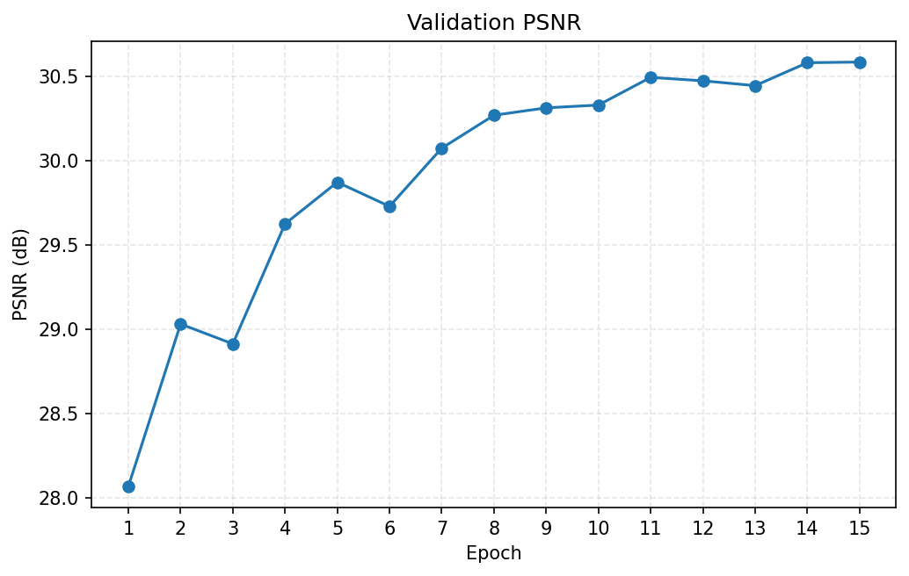
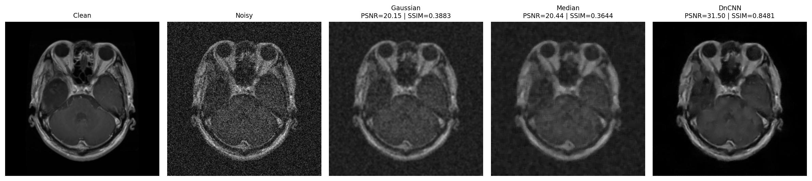

# MedNoise: MRI Denoising with DnCNN

[](https://colab.research.google.com/github/Stefan281/mednoise-mri-denoising/blob/main/notebooks/mednoise.ipynb)

MedNoise is an image-denoising experiment that trains a residual DnCNN model to remove synthetic Rician noise from grayscale brain MRI images. The trained model is evaluated with PSNR and SSIM and compared with Gaussian and median filtering.

## Results

The final model was selected using validation PSNR and evaluated once on the separate official test set.

| Method | Test PSNR (dB) | Test SSIM |
| --- | ---: | ---: |
| Gaussian filter | 21.6121 | 0.5400 |
| Median filter | 21.6735 | 0.5119 |
| **DnCNN** | **30.5162** | **0.8131** |

The best validation result was reached at epoch 15: **30.5867 dB PSNR** and **0.8095 SSIM**.



The qualitative comparison below shows the clean image, noisy input, classical filters, and DnCNN output for one test example.



Additional curves, per-example figures, and raw CSV metrics are available in [`results/`](results/).

## Method

- Images are converted to single-channel grayscale and resized to 224 × 224 pixels.
- Synthetic Rician noise is added with `sigma = 0.10`.
- Training augmentation uses random horizontal flips and rotations up to 10 degrees.
- Validation and test noise are deterministic, making the evaluation reproducible.
- DnCNN predicts a residual noise map, which is subtracted from the noisy input.
- The model has 17 convolutional layers, 32 feature maps, and 139,809 trainable parameters.
- Training uses Adam, mixed precision on CUDA, cosine learning-rate decay, and early stopping.

The dataset split contains 4,760 training, 840 validation, and 1,600 test images. The official test directory remains separate; the validation subset is created only from the original training directory using a fixed seed.

## Repository structure

```text
mednoise-mri-denoising/
├── notebooks/
│   └── mednoise.ipynb
├── results/
│   ├── curves/
│   ├── samples/
│   ├── sample_metrics.csv
│   ├── test_metrics.csv
│   └── training_log.csv
├── DATASET.md
├── requirements.txt
└── README.md
```

The trained checkpoint and source dataset are intentionally excluded from the repository.

## Running the experiment

### Google Colab

1. Upload [`notebooks/mednoise.ipynb`](notebooks/mednoise.ipynb) to Google Colab.
2. Select a GPU runtime.
3. Run all cells in order.

The notebook installs the Colab-specific dependencies and downloads version 2 of the dataset through `kagglehub`. Generated artifacts are written to `/content/MedNoise`.

### Local environment

Install the dependencies:

```bash
python -m venv .venv
python -m pip install -r requirements.txt
```

Activate the environment with `.venv\Scripts\Activate.ps1` on Windows PowerShell or `source .venv/bin/activate` on Linux and macOS, then open the notebook in a Jupyter-compatible environment. By default, local outputs are written to `outputs/`.

To use an existing dataset copy instead of downloading it, set `MEDNOISE_DATA_DIR` to the directory containing the dataset:

```powershell
$env:MEDNOISE_DATA_DIR = "C:\path\to\brain-tumor-mri-dataset"
```

On Linux or macOS:

```bash
export MEDNOISE_DATA_DIR="/path/to/brain-tumor-mri-dataset"
```

## Dataset and attribution

The experiment uses version 2 of the [Brain Tumor MRI Dataset](https://www.kaggle.com/datasets/masoudnickparvar/brain-tumor-mri-dataset), curated by Masoud Nickparvar and distributed under the [CC BY 4.0 license](https://creativecommons.org/licenses/by/4.0/).

The original dataset is not included. The example figures in `results/samples/` are derived from the source dataset and remain subject to its license. See [`DATASET.md`](DATASET.md) for the complete attribution and usage notes.

## Limitations

- The noise is synthetic and may not represent every real MRI acquisition artifact.
- The model processes independent 2D images and does not use 3D anatomical context.
- The experiment uses one fixed data split and one training seed.
- PSNR and SSIM do not replace clinical evaluation.

This project is intended for research and education, not clinical diagnosis.
